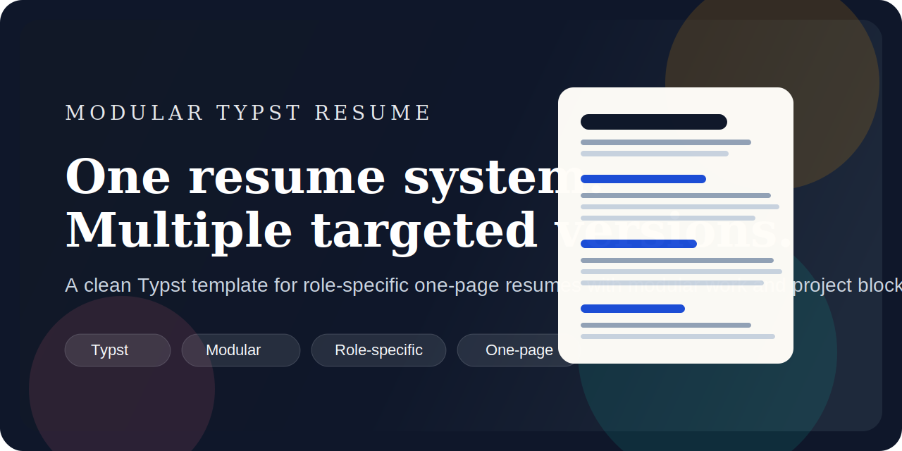

# typst-cv

[English](README.md) | [简体中文](README.zh-CN.md)

[](https://github.com/xiaotianxt/typst-cv/actions/workflows/ci.yml)
[](https://github.com/xiaotianxt/typst-cv/releases)
[](LICENSE)
[](https://github.com/xiaotianxt/typst-cv/generate)
[](https://typst.app)

<p align="center">
  
</p>

<p align="center">
  A modular Typst resume template for shipping multiple targeted one-page CVs from one clean content source.
</p>

<p align="center">
  
</p>

## Why this exists

- One file per work experience or project
- Multiple role-specific resume profiles from the same dataset
- Compile-time overrides for fast custom variants
- Small, readable Typst and YAML instead of heavy template logic
- GitHub Actions CI that compiles every profile on push

## Quick start

1. Install [Typst](https://typst.app).
2. Replace the sample data in `base.yml`, `profiles.yml`, and `modules/`.
3. Build the default resume:

```bash
make compile PROFILE=software-engineer
```

Output lands in `build/software-engineer.pdf`.

## Example profiles

- `software-engineer`: balanced backend and product engineering resume
- `infra-platform`: platform, backend, and reliability emphasis
- `ml-systems`: ML infrastructure and GPU systems angle
- `research-heavy`: projects before work experience

List available profiles:

```bash
make profiles
```

Build all profiles:

```bash
make all
```

Watch one profile:

```bash
make watch PROFILE=infra-platform
```

Run checks:

```bash
make check-all
```

Refresh the README preview image:

```bash
make preview PROFILE=software-engineer
```

## Repository structure

```text
.
├── main.typ
├── base.yml
├── profiles.yml
├── modules/
│   ├── work/
│   └── projects/
├── lib/
│   ├── style.typ
│   ├── modules.typ
│   └── utils.typ
├── scripts/style-check.sh
└── .github/workflows/ci.yml
```

## How it works

- `base.yml` stores shared identity, education, and skills.
- `modules/work/*.yml` stores one experience block per file.
- `modules/projects/*.yml` stores one project per file.
- `profiles.yml` assembles targeted resume variants by selecting module keys.
- `main.typ` renders the selected profile into a single-page PDF.

You can also override selections without editing `profiles.yml`:

```bash
typst compile main.typ build/custom.pdf \
  --input profile=software-engineer \
  --input work=northstar-cloud,aperture-ai \
  --input projects=distributed-cache,query-engine
```

## Customization workflow

1. Replace the sample identity in `base.yml`.
2. Edit or duplicate files under `modules/work/` and `modules/projects/`.
3. Recompose your variants in `profiles.yml`.
4. Run `make check-all` before pushing.

Profiles can override section order with `sectionOrder`. Supported values are `education`, `work`, `projects`, and `skills`.

## Chinese / CJK support

- The template stays warning-free by default and ships with an English sample dataset.
- To render Chinese content, point `headingfont` and `bodyfont` in `main.typ` at fonts installed on your machine.
- Chinese documentation is available in [README.zh-CN.md](README.zh-CN.md).

Example CJK font override:

```typst
#let uservars = (
  ..default-uservars,
  headingfont: ("Songti SC", "Source Han Serif SC", "Noto Serif CJK SC"),
  bodyfont: ("Songti SC", "Source Han Serif SC", "Noto Serif CJK SC"),
  margin: 0.40in,
  fontsize: 10pt,
  linespacing: 6pt,
)
```

## GitHub launch checklist

1. Create a new GitHub repository named `typst-cv`.
2. Mark it as a template repository.
3. Set `assets/project-hero.svg` or `assets/resume-preview.png` as the social preview image.
4. Use a short repo description like:

> Modular Typst resume template for role-specific one-page CVs.

## License

MIT
